<div align="center">
    
   <br>
   
   <br>
   

   <br>

<p>
<a href="https://github.com/Pazl27/nix-config/commits/master/"></a>&nbsp;&nbsp;
<a href="https://github.com/Pazl27/nix-config/stargazers"></a>&nbsp;&nbsp;
<a href="https://nixos.org"></a>&nbsp;&nbsp;
<a href="https://github.com/Pazl27/nix-config/blob/master/LICENSE"></a>&nbsp;&nbsp;
</p>
</div>

# Description
This repository contains my nixos dotfiles. The hole configuration is based around the colortheme **gruvbox**.
I'm using Hyprland as my window manager. 
This repostory contains configurations for the applications I use on a daily basis.
This configuration is used on my desktop pc and a windows wsl instance. I'm mostly using it for programming, gaming and browsing the web.
It also conations my neovim configuration which is set up to work with go, rust and c++.
My configuration has also integrated ai assistance, which can help you with quick questions or code snippet generation.

# Preview
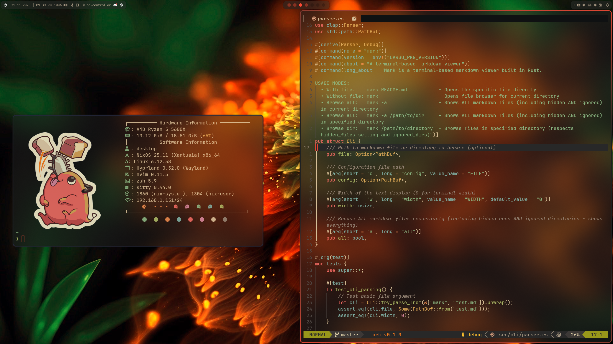
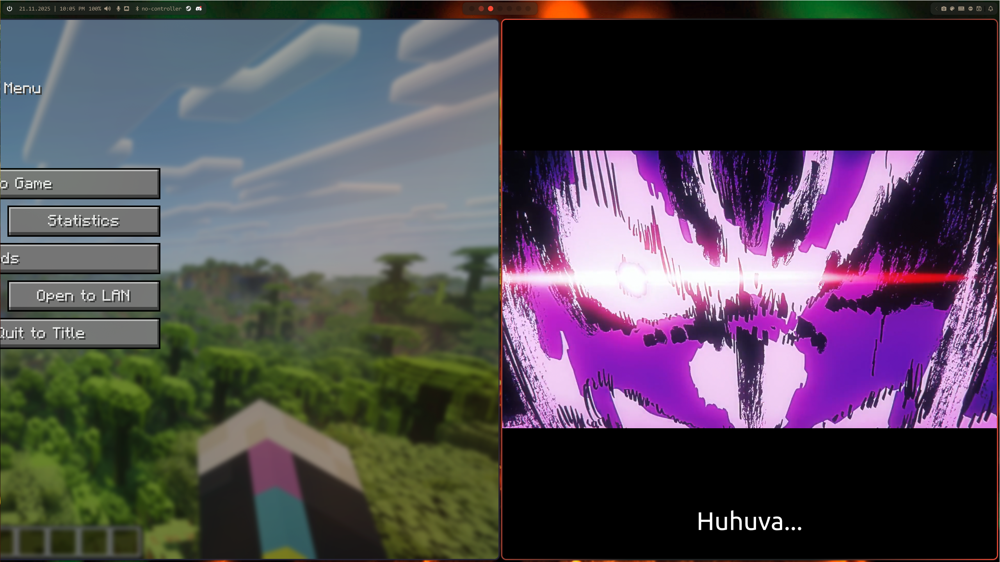
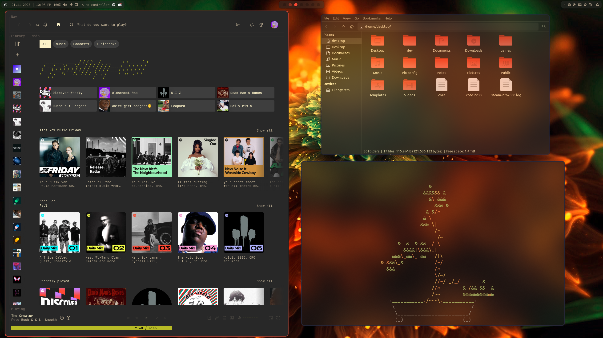
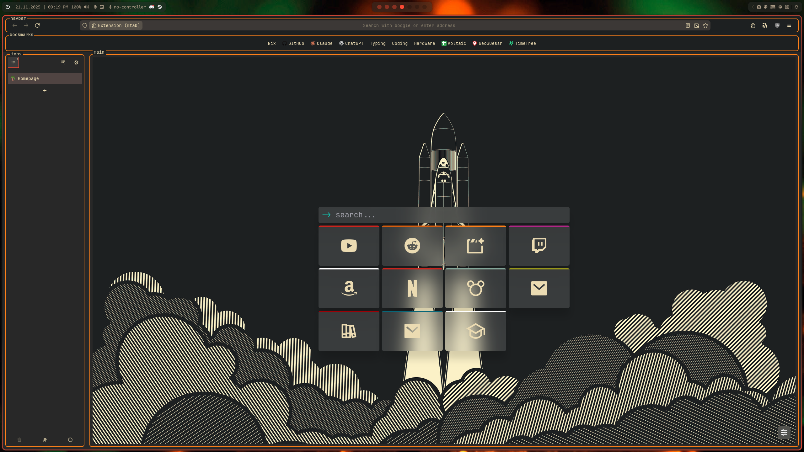
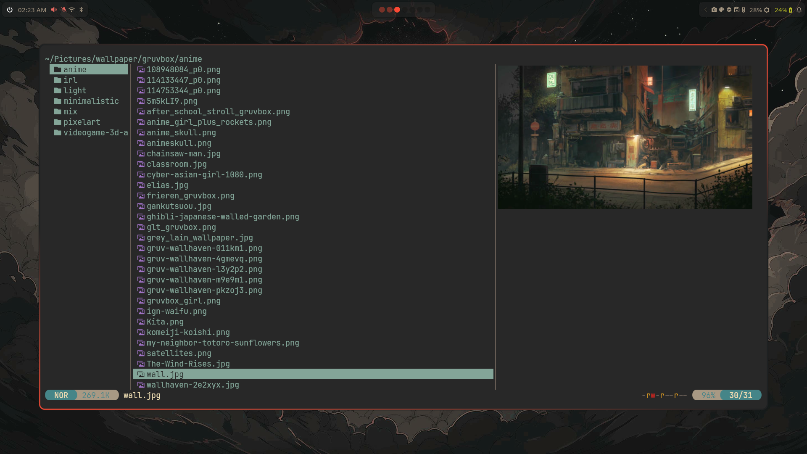

# Applications

<details>
  <summary>Waybar</summary>
  
  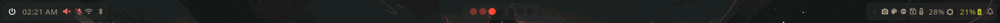

  ### Overview
  Custom Waybar configuration for Hyprland with a clean, efficient design. Features essential system info and quick access to common actions through SwayNC integration.

  ### Workspaces
  Dynamic workspace indicators with visual feedback - active workspaces show a lighter red dot. Starts with 7 workspaces and expands automatically as needed.

  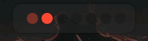

  ### Expanding Widgets
  Right side modules include notifications (SwayNC), battery, music player, and an expanding widget with system stats (temperature, disk, CPU), screenshot tools, color picker, and brightness controls.

  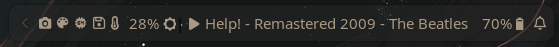

  ### WiFi and Bluetooth
  Left side features power, clock, sound, WiFi, and Bluetooth modules. WiFi and Bluetooth launch Rofi scripts for easy device/network management. Sound module controls microphone muting, with right-click opening pulsemixer.

  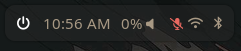

  ### Configuration
  Waybar is configured declaratively through NixOS. Enable in your `home.nix`:
```nix
  features.application.waybar.enable = true;
```

  Configuration location: `modules/home/applications/waybar.nix`

</details>

<details>
  <summary>Rofi</summary>

  ### Overview
  Application launcher and menu system, primarily used for launching apps, SSH connections, WiFi/Bluetooth management, and system controls.

  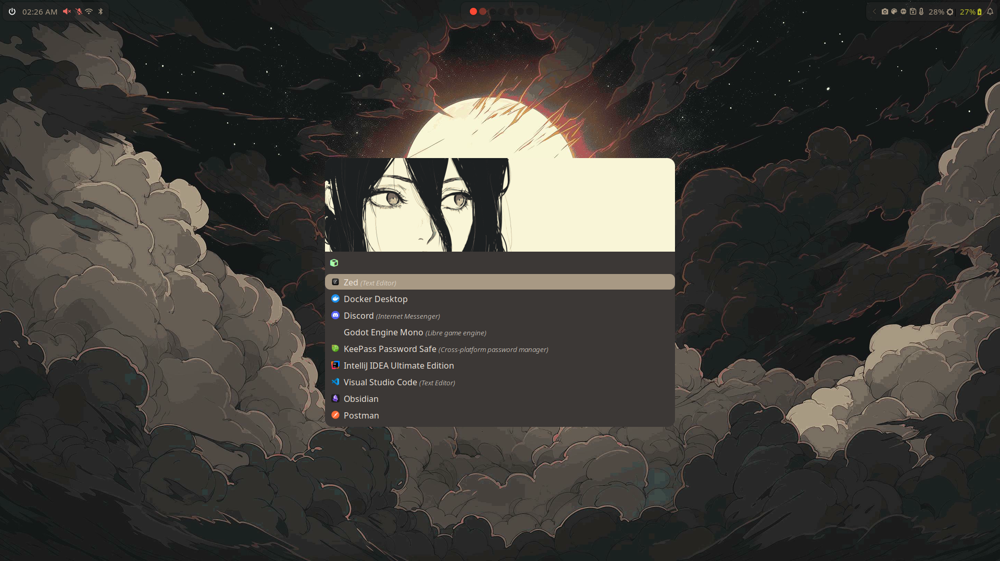

  ### Configuration
  Rofi is configured through NixOS with custom themes and scripts:
```nix
  features.application.rofi.enable = true;
```

  Custom scripts available in `~/.config/scripts/rofi/`:
  - `wifi.sh` - WiFi manager
  - `bluetooth.sh` - Bluetooth device manager
  - `wallpaper_switcher.sh` - Wallpaper selector
  - `resolution.sh` - Display resolution changer

  Configuration location: `modules/home/applications/rofi.nix`

</details>

<details>
  <summary>SwayNC</summary>

  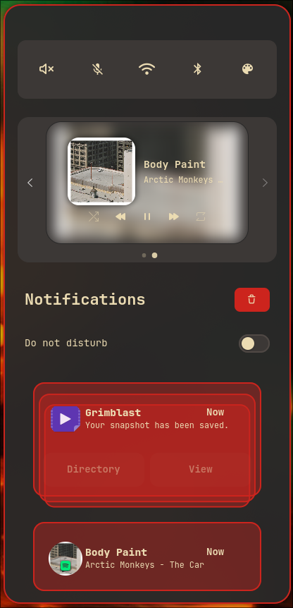

  ### Overview
  Notification center for Wayland with custom Gruvbox theme. Provides notification history, do-not-disturb mode, and notification controls.

  ### Configuration
  Enable in your `home.nix`:
```nix
  features.application.swaync.enable = true;
```

  Configuration location: `modules/home/applications/swaync.nix`

</details>

<details>
  <summary>Neovim</summary>
  
  ### Overview
  Configured with [NixVim](https://github.com/nix-community/nixvim) - a Nix-based configuration framework that manages plugins, LSP, and keybindings declaratively. No Lua required, everything defined in Nix modules.

  **Features:**
  - LSP with rust-analyzer, nil, pyright, and more
  - GitHub Copilot integration
  - Treesitter syntax highlighting
  - Telescope fuzzy finder
  - Lazygit integration
  - Custom Gruvbox theme

  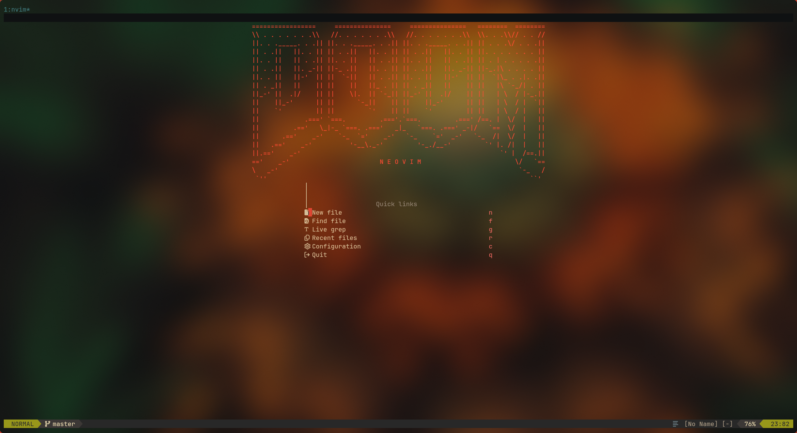
  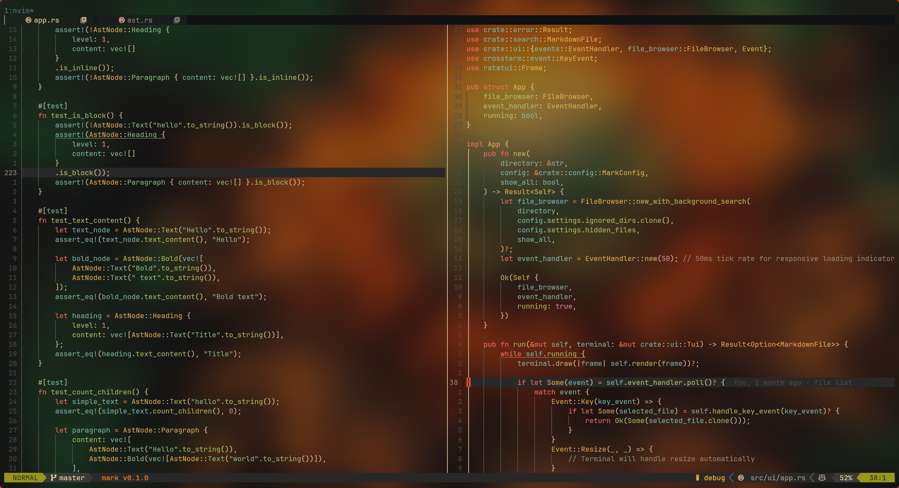

  ### Configuration
  Enable in your `home.nix`:
```nix
  features.editors.nvim.enable = true;
```

  Configuration location: `modules/home/editors/nvim/`

</details>

<details>
  <summary>Zed</summary>

  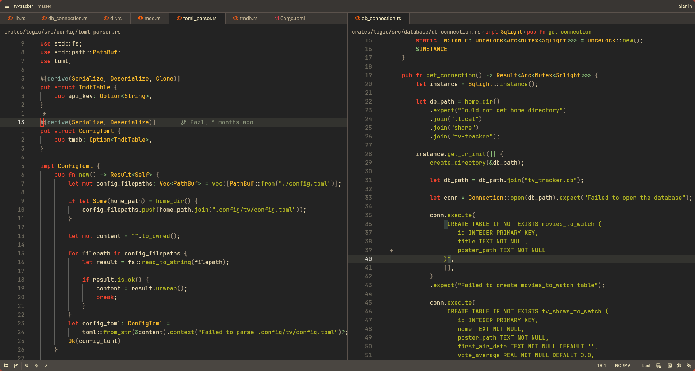

  ### Overview
  My **main editor** for all programming projects. Zed offers lightning-fast performance, clean interface, and excellent navigation. While Neovim handles quick edits and config files, Zed is my go-to for serious development.

  **Why Zed:**
  - Lightning fast performance and startup times
  - Intuitive navigation that feels natural
  - Modern UI that stays out of the way
  - Excellent language support for Rust, Go, TypeScript, and more
  - Built-in collaboration features

  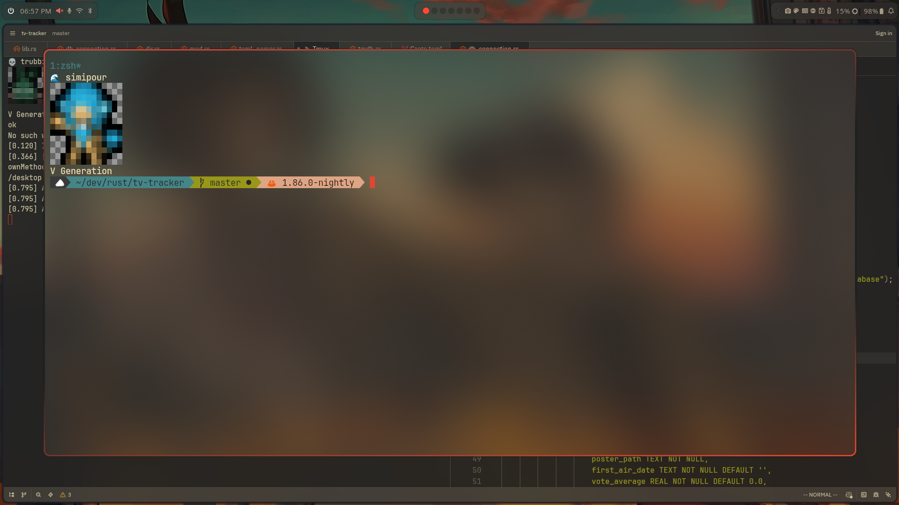

  ### Git Integration with Lazygit
  Custom tasks integrate with Lazygit for all Git management:
  - Quick access to git status and staging
  - Visual diff and merge conflict resolution
  - Branch management and history viewing
  - Seamless workflow between coding and version control

  ### Terminal Integration with Tmux
  Custom terminal launcher (`zed-tmux.sh`) that:
  - Launch command: `space + t + t`
  - Launches kitty terminal with tmux session
  - Names session after current project directory
  - Maintains persistence - sessions survive terminal closure
  - Always opens in the correct project directory

  ### Configuration
  Enable in your `home.nix`:
```nix
  features.editors.zed.enable = true;
```

  Configuration files:
  - Settings: `modules/home/editors/zed/zed-settings.nix`
  - Keybindings: `modules/home/editors/zed/zed-keybindings.nix`
  - Tasks: `modules/home/editors/zed/zed-tasks.nix`
  - Script: `scripts/zed-tmux.sh`

</details>

<details>
  <summary>Wlogout</summary>

  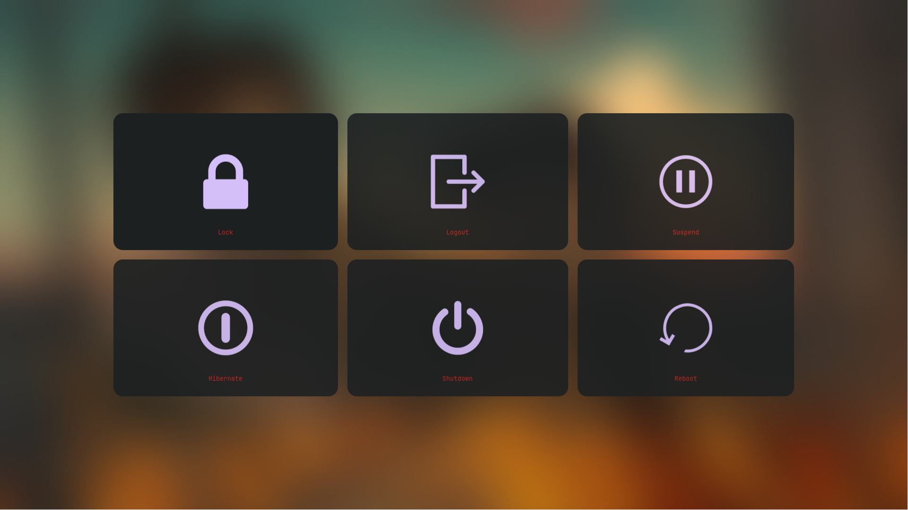

  ### Overview
  Logout menu with options for shutdown, reboot, logout, and lock. Styled with custom Gruvbox theme to match the rest of the setup.

  ### Configuration
  Enable in your `home.nix`:
```nix
  features.application.wlogout.enable = true;
```

  Keybinding configured in Hyprland to launch wlogout.

  Configuration location: `modules/home/applications/wlogout.nix`

</details>

<details>
  <summary>Thunar</summary>

  ### Overview
  GTK-based file manager with custom Gruvbox theming, automatic mounting support, and archive plugin integration.

  ### Configuration
  Enable in your `home.nix`:
```nix
  features.application.thunar.enable = true;
```

  Features:
  - Automatic device mounting with udiskie
  - Archive support with file-roller
  - Thumbnail generation
  - Custom Gruvbox theme

  Configuration location: `modules/home/applications/thunar.nix`

</details>

<details>
  <summary>Kitty</summary>

  ### Overview
  Modern terminal emulator with excellent performance and Wayland support. Configured with Gruvbox Dark theme.

  ### Configuration
  Enable in your `home.nix`:
```nix
  features.application.kitty.enable = true;
```

  Configuration location: `modules/home/applications/kitty.nix`

</details>

<details>
  <summary>Firefox</summary>

  ### Overview
  Web browser configured with [Textfox](https://github.com/adriankarlen/textfox) theme for a minimal, keyboard-focused browsing experience.

  ### Configuration
  Enable in your `home.nix`:
```nix
  features.application.firefox.enable = true;
```

  Configuration location: `modules/home/applications/firefox.nix`

</details>

<details>
  <summary>Spotify</summary>

  ### Overview
  Music player with [Spicetify](https://spicetify.app/) customization for theming and enhanced features. Styled with custom Gruvbox theme.

  ### Configuration
  Enable in your `home.nix`:
```nix
  features.application.spotify.enable = true;
```

  Configuration location: `modules/home/applications/spotify.nix`

</details>

---

# Keyboard Shortcuts

These are the keybindings I use in Hyprland, configured in my `keymaps.conf`.
The `SUPER` key refers to the **Left Alt** or **Option** key on most keyboards.

| Shortcut                            | Action Description                                  |
|-------------------------------------|-----------------------------------------------------|
| <kbd>Super</kbd> + <kbd>Return</kbd>        | Open terminal (`kitty`)                             |
| <kbd>Super</kbd> + <kbd>Q</kbd>            | Kill the active window                              |
| <kbd>Super</kbd> + <kbd>M</kbd>            | Exit Hyprland session                               |
| <kbd>Super</kbd> + <kbd>Shift</kbd> + <kbd>E</kbd> | Open file manager (`nautilus`)                |
| <kbd>Super</kbd> + <kbd>E</kbd>            | Launch terminal file manager (`yazi.sh`)            |
| <kbd>Super</kbd> + <kbd>B</kbd>            | Open browser (`zen-browser`)                        |
| <kbd>Super</kbd> + <kbd>V</kbd>            | Toggle floating mode                                |
| <kbd>Super</kbd> + <kbd>Space</kbd>        | Open app launcher (`rofi -show drun`)               |
| <kbd>Super</kbd> + <kbd>F</kbd>            | Toggle fullscreen                                   |
| <kbd>Super</kbd> + <kbd>D</kbd>            | Toggle split layout (dwindle only)                  |
| <kbd>Super</kbd> + <kbd>N</kbd>            | Open SwayNc notification manager         |
| <kbd>Super</kbd> + <kbd>W</kbd>            | Open WiFi selector (`rofi/wifi.sh`)                 |
| <kbd>Super</kbd> + <kbd>G</kbd>            | Switch wallpaper (`rofi/wallpaper_switcher.sh`)     |
| <kbd>Super</kbd> + <kbd>A</kbd>            | Launch AI assistant (`askai.sh`)                    |
| <kbd>Super</kbd> + <kbd>Shift</kbd> + <kbd>S</kbd> | Take screenshot (`snapshot.sh`)             |
| <kbd>Super</kbd> + <kbd>I</kbd>            | Open logout screen (`wlogout`)                      |
| <kbd>Super</kbd> + <kbd>P</kbd>            | Open Install manager (`rofi/list-installer.sh`)     |
| <kbd>Super</kbd> + <kbd>R</kbd>            | Open Repository list (`rofi/repo-rofi.sh`)     |
---

# Scripts
## Ai assistant
This dotfiles setup includes a minimal yet powerful **AI assistant workflow**, tightly integrated with the Linux desktop via [Rofi](https://github.com/davatorium/rofi), [Gemini API](https://ai.google.dev), and [Glow](https://github.com/charmbracelet/glow) for terminal markdown rendering.

### Features

- Triggered with a keyboard shortcut (<kbd>Super</kbd> + <kbd>A</kbd>).
- Prompt input via Rofi dmenu.
- AI responses fetched using [Gemini 2.0 Flash](https://ai.google.dev/) (with **free API key**).
- Response rendered beautifully in a floating `kitty` terminal using `glow`.

###  How it works

1. Press your configured keybinding (<kbd>Super</kbd> + <kbd>A</kbd>).
2. Rofi pops up asking for your question.
3. Your input is sent to the Gemini API via a small Bash script.
4. The markdown-formatted AI response is saved to a temporary file.
5. A floating `kitty` window opens, displaying the answer with `glow`.

### Screenshots

#### 1. Prompt Input via Rofi
> Ask your question directly via a clean Rofi popup


#### 2. Markdown Output in Terminal
> Answer rendered with `glow` in a floating kitty window

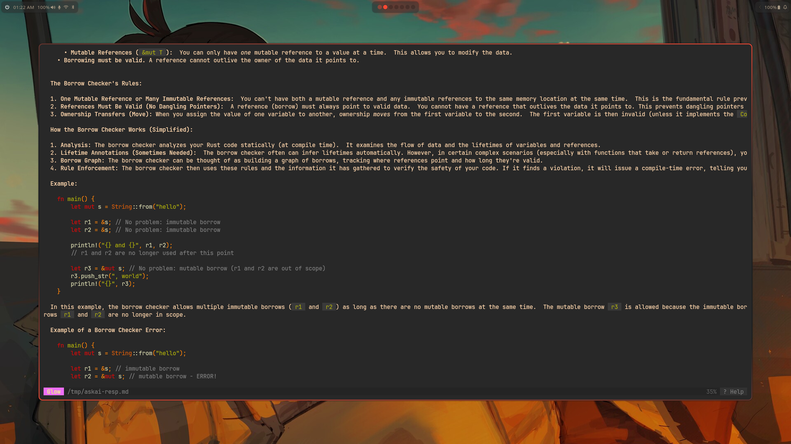

### Config Notes

- The Gemini API key is sourced from a `.env` file to keep it out of version control.
- Kitty is launched with a custom script to ensure the display floats and closes on demand the floating behavior is regulated with the hyprland config and classes.
- `glow` is used for TUI markdown reading — clean and readable.

### Scripts location

You’ll find the related scripts inside:
`~/.config/scripts/rofi/ai/`

Main scripts:
- `askai.sh` — handles prompt input and API call
- `display-resp.sh` — renders the markdown response with glow

## Installation Manager
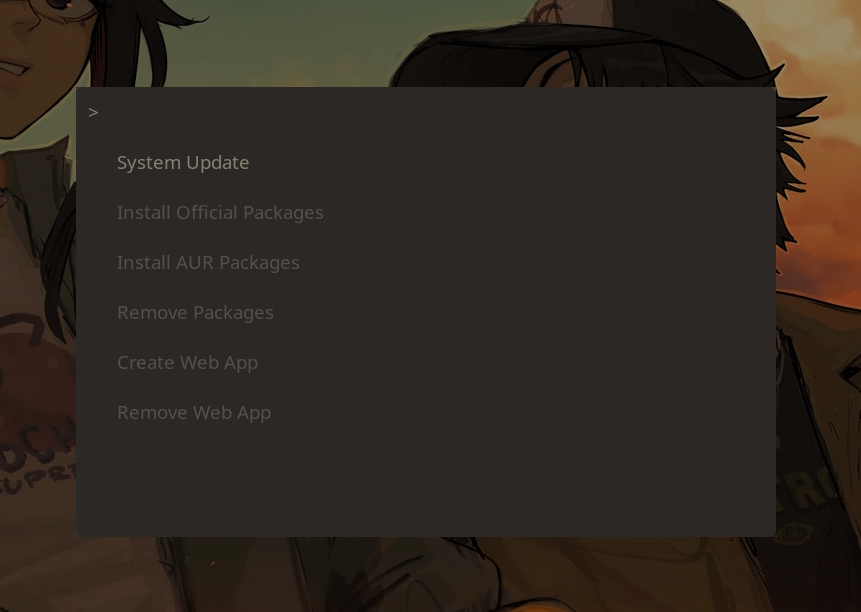

The Installation Manager is a comprehensive package and webapp management system built around Rofi and FZF. It provides an intuitive interface for installing packages, managing system updates, and creating web applications. The scripts and the manager is inspired by Omachy.

### Features

- **Package Management**: Install/remove official Arch packages and AUR packages
- **System Updates**: Check and apply system updates with preview
- **Web App Creation**: Convert any website into a standalone desktop application
- **Interactive UI**: Beautiful FZF interfaces with package previews and information
- **Multi-selection**: Install multiple packages at once
- **PKGBUILD Preview**: View AUR package build files before installation

### Usage

Launch the Installation Manager with `Super + P` and choose the action you want to do.

#### Available Options:

1. **System Update** - Check and apply system updates
   - Shows available updates with package information
   - Updates both official repos and AUR packages
   - Updates locate database after completion

2. **Install Official Packages** - Browse and install from official repositories
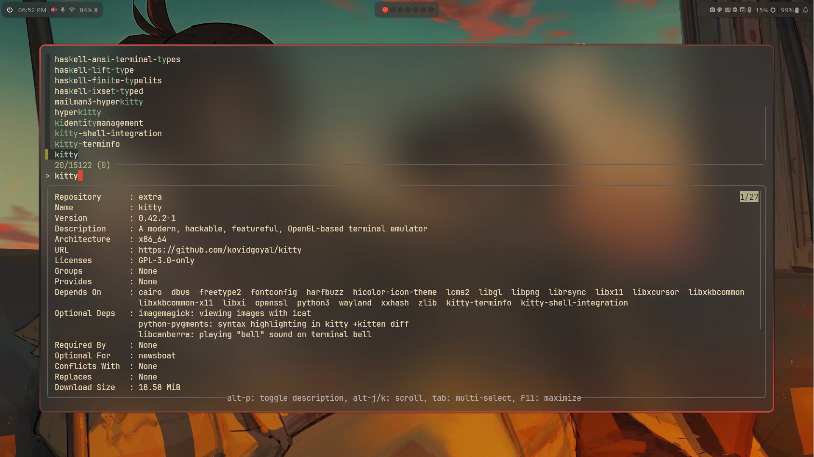
   - Multi-select packages with Tab
   - Preview package information with `pacman -Sii`
   - Browse through existing packages

3. **Install AUR Packages** - Browse and install from AUR
   - Multi-select AUR packages
   - Preview package info and PKGBUILD files
   - Browse through existing packages

4. **Remove Packages** - Uninstall packages with dependencies
   - Shows only explicitly installed packages
   - Multi-select for batch removal
   - Preview installed package information

5. **System Update** - Create a system update
   - Shows all packages that have updates
   - see version increment of packages
   - Preview installed package information

6. **Create Web App** - Convert websites to desktop applications
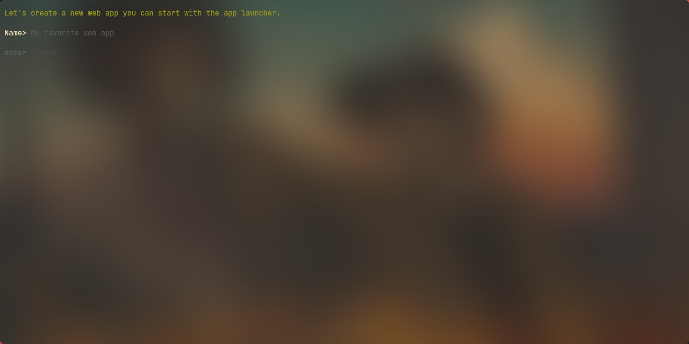
   - Enter app name, URL, and icon URL
   - Automatically downloads and sets up icons
   - Creates .desktop files for app launcher integration
   - Uses browser app mode to hide UI elements
   - The app can be found in the rofi menu after installation
  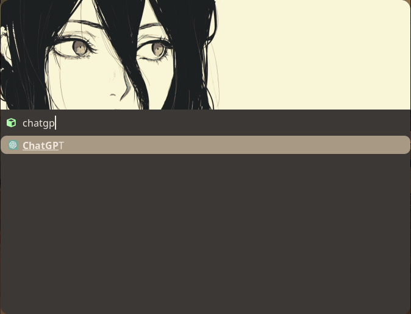


7. **Remove Web App** - Clean up created web applications
   - Lists all created web apps
   - Multi-select for batch removal
   - Removes both .desktop files and icons

### Dependencies

```plaintext
rofi
fzf
pacman
yay
gum
curl
kitty
```

### How It Works

The system consists of several interconnected scripts:

- `list-installer.sh` - Main rofi menu interface
- `pkg-packman-install.sh` - Official package installation with fzf
- `pkg-aur-install.sh` - AUR package installation with fzf
- `pkg-remove.sh` - Package removal with fzf
- `system-update.sh` - System update manager
- `webapp-install.sh` - Web application creator
- `webapp-launch.sh` - Web application launcher
- `webapp-remove.sh` - Web application removal
- `show-done.sh` - Completion indicator

All scripts use consistent styling and integrate seamlessly with the desktop environment. The web app feature is particularly powerful, allowing you to create desktop shortcuts for web services like ChatGPT, YouTube, or any web application, complete with custom icons and app-like behavior.


## Repo finder
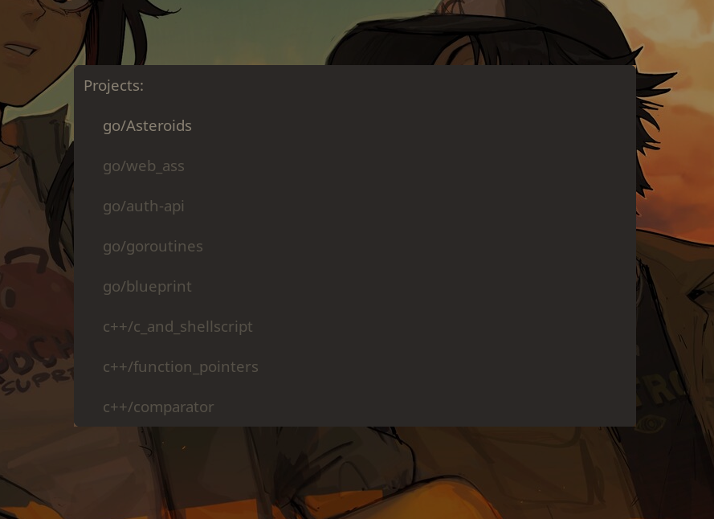

The repo finder script is my go-to solution for quickly navigating between all my development projects. It provides a centralized way to access any project in my `~/dev` directory structure, making project switching effortless and organized.

### How it works

The script scans my development directory structure and presents all projects in a clean Rofi interface:

1. **Scans project directories** in `~/dev/*/*` (two levels deep)
2. **Lists all available projects** in a Rofi menu
3. **Launches a terminal** with tmux in the selected project directory
4. **Creates/attaches to tmux session** named after the project
5. **Kills existing terminal** to maintain a single focused workspace

### Key features

- **Centralized project access**: All my development projects in one searchable menu
- **Tmux integration**: Each project gets its own persistent tmux session
- **Clean workspace**: Automatically manages terminal instances to avoid clutter
- **Project-aware sessions**: Session names match project directories for easy identification
- **Instant context switching**: Jump directly into any project with full terminal environment

### Directory structure

My projects are organized as `~/dev/category/project-name`, which allows the script to discover everything automatically. For example:
- `~/dev/rust/my-cli-tool`
- `~/dev/web/portfolio-site`
- `~/dev/go/api-server`

This script is incredibly useful for keeping everything organized in one place. Instead of manually navigating to project directories or remembering where everything is located, I can just trigger the repo finder and instantly jump into any project with the proper development environment already set up.

**Script location**: `~/.config/scripts/rofi/repo-rofi.sh`

## Wallpaper selector
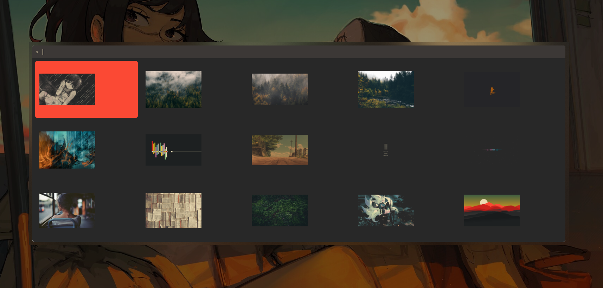

The wallpaper selector script is one of my most frequently used utilities, bound to `Super + G` for quick access. It provides an elegant way to browse and switch between my collection of Gruvbox wallpapers with visual previews.

### How it works

The script uses a combination of `find`, `rofi`, and `swww` to create a seamless wallpaper switching experience:

1. **Scans the wallpaper directory** (`~/Pictures/wallpaper/gruvbox`) for image files
2. **Randomizes the order** using `shuf` to keep things interesting
3. **Displays previews** in a Rofi menu with icons showing each wallpaper thumbnail
4. **Instantly applies** the selected wallpaper using `swww` with no transition
5. **Shows notification** with the wallpaper name when changed

### Key features

- **Visual previews**: See exactly what each wallpaper looks like before selecting
- **Fast switching**: Instant wallpaper changes with no fade transitions
- **Gruvbox collection**: Most wallpapers sourced from the excellent [gruvbox-wallpapers repo](https://github.com/AngelJumbo/gruvbox-wallpapers)
- **Randomized order**: Keeps the selection fresh each time you open it
- **Notification feedback**: Confirms which wallpaper was applied

This script makes wallpaper management incredibly convenient - I can quickly browse through my entire collection and see exactly what each one looks like before applying it. The preview functionality is especially handy since I can make informed choices without guessing from filenames.

**Script location**: `~/.config/scripts/rofi/wallpaper_switcher.sh`

---


# NixOS Configuration

## Overview

This is a modular NixOS configuration supporting multiple deployment methods:

- **NixOS + Home Manager**: Full system configuration (`desktop`, `nixvm`)
- **Home Manager Only**: User-space configuration for non-NixOS systems (`nix-wsl`)

All configurations share the same Home Manager modules, ensuring consistent application setups across all machines. The configuration uses **Nix Flakes** for reproducibility and a **feature-flag system** for enabling/disabling components.

## Configuration Files

### `variables.nix`
Host-specific values like git credentials, boot settings, and hardware preferences:
```nix
{
  # Boot
  bootDevice = "nodev";
  useUEFI = true;
  
  # Git
  gitUsername = "YourName";
  gitEmail = "your@email.com";
  
  # Hardware (optional)
  nvidiaVibrance = 512;
}
```

### `home.nix`
Enable/disable applications and features:
```nix
{
  features = {
    wm.hyprland.enable = true;
    
    editors = {
      nvim.enable = true;
      zed.enable = true;
    };
    
    application = {
      firefox.enable = true;
      spotify.enable = true;
      discord.enable = true;
    };
    
    tools = {
      git.enable = true;
      yazi.enable = true;
    };
  };
}
```

## Adding a New Host

1. **Create host directory:**
```
   hosts/laptop/
   ├── configuration.nix  # System config
   ├── default.nix        # Imports
   ├── hardware-configuration.nix  # Auto-generated
   ├── home.nix          # User config
   └── variables.nix     # Host-specific values
```

2. **Add to `flake.nix`:**
```nix
   hosts = {
     laptop = {
       username = "yourname";
       homeDirectory = "/home/yourname";
       hostConfig = ./hosts/laptop;
       isNixOS = true;  # or false for Home Manager only
     };
   };
```

3. **Build:**
```bash
   # NixOS
   sudo nixos-rebuild switch --flake .#laptop
   
   # Home Manager only
   home-manager switch --flake .#laptop
```

## Module Organization
```
modules/
├── core/          # System: bootloader, fonts, security
├── drivers/       # Hardware: nvidia, amd, intel
└── home/
    ├── applications/  # GUI apps
    ├── editors/       # Neovim, Zed, VS Code
    ├── environments/  # Dev languages
    ├── tools/         # CLI utilities
    └── wm/            # Window managers
```

Enable what you need in `home.nix`, everything is opt-in.

---

# Keyboard

I use a **Corne (crkbd) v4** keyboard — a split, column-staggered 40% layout with 3 layers. Mine is the **wired version**, and I got it from [KeebArt](https://www.keebart.com/de/produkte/corne). It's compact, ergonomic, and a joy to type on once you get used to the layering system.

I use **Vial** to configure and flash my keymap. Vial makes it easy to customize layers, remap keys on the fly, and store changes directly in the keyboard’s memory.
But mainly, I use a wireless Corne build. The configuration for this build can be found in this [repo](https://github.com/Pazl27/zmk-config-corne). This is the setup I use as my daily driver. The one below is a bit older.


## My Layer Setup

I use a total of **three layers**:

### Layer 0 – Typing Layer (QWERTZ)
This is my main typing layer, customized for the German QWERTZ layout. It includes standard alphanumeric keys and a few custom modifiers.

**Visual:**
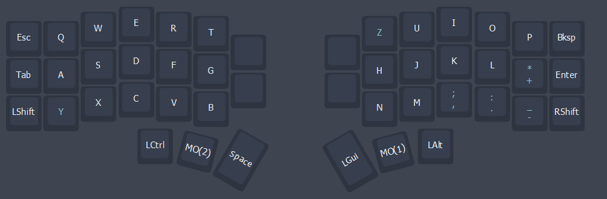

---

### Layer 1 – Numbers & Symbols
This layer gives quick access to:
- Numbers (0–9)
- Common symbols like `!`, `=`, `#`, `*`, `&` etc.
- Brackets and mathematical operators

**Visual:**
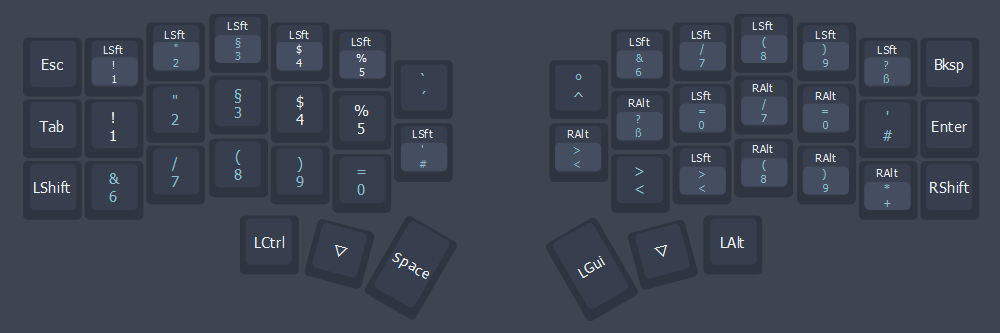

---

### Layer 2 – German Letters, Arrows & Media
This layer adds:
- German-specific characters like `ä`, `ö`, `ü`, `ß`
- Symbols like `@`, `€`, etc.
- Arrow keys
- Media controls (volume, play/pause, etc.)

**Visual:**
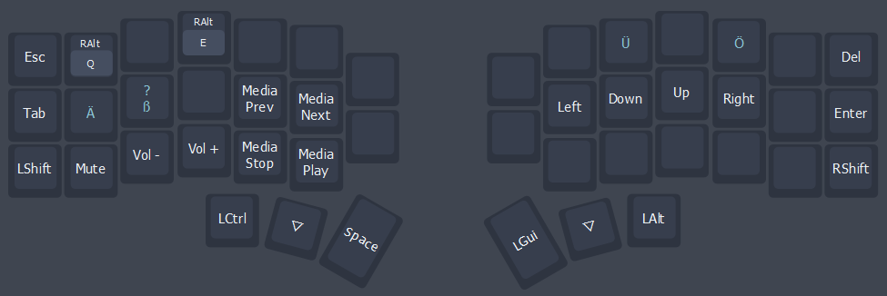

