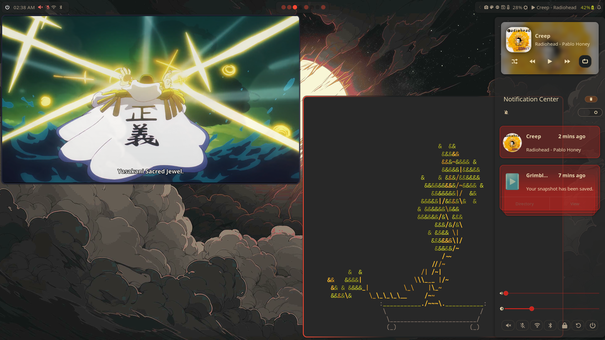
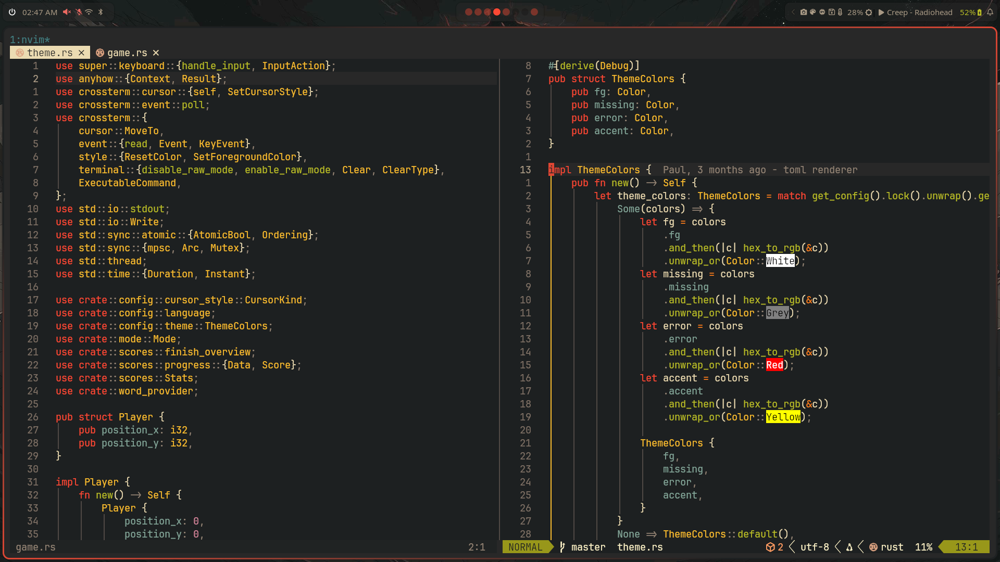

[](https://git.io/typing-svg)

<div align="center">
<p>
<a href="https://github.com/Pazl27/nix-config/stargazers"></a>&nbsp;&nbsp;
<a href="https://github.com/Pazl27/nix-config/forks"></a>&nbsp;&nbsp;
<a href="https://github.com/Pazl27/nix-config/commits/master/"></a>&nbsp;&nbsp;
<a href="https://github.com/Pazl27/nix-config/blob/master/LICENSE"></a>&nbsp;&nbsp;
</p>
</div>

# Description
This repository contains my nixos dotfiles. The hole configuration is based around the colortheme **gruvbox**.
I'm using Hyprland as my window manager. 
This repostory contains configurations for the applications I use on a daily basis.
This configuration is used on my desktop pc and a windows wsl instance. I'm mostly using it for programming, gaming and browsing the web.
It also conations my neovim configuration which is set up to work with go, rust and c++.
My configuration has also integrated ai assistance, which can help you with quick questions or code snippet generation.

# Preview





# Applications

<details>

  <summary>Waybar</summary>
   

   ### Overview
   This is my Waybar setup for Hyprland, designed to be clean and efficient. It includes all the essential features I wanted in Waybar. For additional needs like volume control, I use swaync, which can be     triggered from Waybar. It is possible to take screenshot, use a color picker or mute the microphone.

  ### Workspaces
  I've configured the workspaces so that if a workspace contains any open content, its indicator dot appears in a lighter shade of red. This makes it easier to keep track of active workspaces. Initially, only 7         workspaces are displayed, but more are added dynamically as needed when you go beyond 7.

   

  ### Expanding Widgets
  On the right side of the Waybar, you'll find the notification module (which opens SwayNC), the battery level, the music display, and the expanding widget.
  Inside the expanding widget, there are several useful tools and statistics. You can monitor key system stats such as temperature, disk space, and CPU usage.
  In addition, there are icons for taking screenshots and using a color picker. You can also adjust the screen brightness directly from this widget.

  

  ### Wifi and Bluetooth
  On the left side of the Waybar, you'll find the following modules: power, clock, sound, Wi-Fi, and Bluetooth.
  Both the Bluetooth and Wi-Fi modules launch a Rofi script when clicked. These scripts make it easy to connect to devices or select and log into Wi-Fi networks.
  The sound module allows you to mute the microphone, and a right-click opens pulsemixer in a floating terminal window.
  The power module opens wlogout.

  

   ### *How To Install*
1. **Install `Waybar`:**

   ```
    sudo pacman -S waybar
   ```

2. Copy the `Dotfiles/.config/waybar` folder into `~/.config`


  ## Dependencies
  ```plaintext
  swaync
  grimblast
  hyprpicker
  wl-copy
  wlogout
  rofi
  pulsmixer
  kitty
  ```

</details>

<details>

  <summary>Rofi</summary>

   ### Overview
   This is my roif setup. It is mainly used for launching apps and ssh connections.
   

  ### *How To Install*

1. **Install `Rofi`:**

   ```
    sudo pacman -S rofi-wayland
   ```

2. Copy the `Dotfiles/.config/rofi` folder into `~/.config`
3. **Launching Rofi**
    - I launch rofi like this:

      ```config
      rofi -show drun
      ```

</details>

<details>

  <summary>Swaync</summary>
   

   ### *How To Install*

1. **Install `swaync`:**

    ```bash
    sudo pacman -S swaync
    ```
2. Copy the `Dotfiles/.config/swaync` folder into `~/.config`

  ### Dependencies for `Swaync`
  ```
  swaync
  rofi
  libnotify
  ```

</details>

<details>

  <summary>Neovim</summary>
   

</details>

<details>

  <summary>Zed</summary>
   

   ### Overview
   Zed is my **main editor** and the tool I use for all my programming projects. I love Zed for its speed, clean interface, and excellent navigation features. While I still use Neovim for small edits and config files, Zed handles all my serious development work.

   What makes Zed special for my workflow:
   - **Lightning fast** performance and startup times
   - **Intuitive navigation** that feels natural
   - **Modern UI** that stays out of the way
   - **Excellent language support** for Rust, Go, TypeScript, and more
   - **Built-in collaboration** features (though I mainly use it solo)

   

   ### Git Integration with Lazygit
   I've set up custom tasks in Zed to integrate with **Lazygit** for all my Git management needs. This gives me a powerful TUI for staging, committing, branching, and handling merge conflicts without leaving my editor environment.

   The Lazygit integration allows me to:
   - Quick access to git status and staging
   - Visual diff and merge conflict resolution
   - Branch management and history viewing
   - Seamless workflow between coding and version control

   ### Terminal Integration with Tmux
   One of my favorite Zed setups is the **terminal launcher** i created that automatically opens a terminal with tmux in the current project directory. This is handled by my `zed-tmux.sh` script, which:

   - Launch command: `space + t + t`

   - **Launches kitty terminal** with tmux session
   - **Names the session** after the current project directory
   - **Maintains persistence** - even when I close the terminal, my tmux session keeps running
   - **Quick access** to run tests, servers, and development commands
   - **Project context** - always opens in the right directory

   This means I can run my development server, tests, or any long-running processes, and they'll persist even if I accidentally close the terminal window.

   ### *How To Install*
1. **Install `Zed`:**

    ```bash
    sudo pacman -S zed
    ```

2. Copy `Dotfiles/.config/zed` into `~/.config/`

3. **Set up the terminal launcher:**
   - Copy the `zed-tmux.sh` script to `~/.config/scripts/`
   - Make it executable: `chmod +x ~/.config/scripts/zed-tmux.sh`
   - Configure Zed tasks to use the script for that checkout my `.config/zed/task.json`

  ### Dependencies
  ```plaintext
  zed
  lazygit
  tmux
  kitty
  ```

</details>

<details>

  <summary>Wlogout</summary>
   

   ### *How To Install*
1. **Install `wlogout`:**

    ```bash
    yay -S wlogout
    ```
2. Copy `Dotfiles/.config/wlogout` into `~/.config/`
3. If not already set make sure you set a key bind in hyprland.conf to launch wlogout.

</details>

---

# Keyboard Shortcuts

These are the keybindings I use in Hyprland, configured in my `keymaps.conf`.
The `SUPER` key refers to the **Left Alt** or **Option** key on most keyboards.

| Shortcut                            | Action Description                                  |
|-------------------------------------|-----------------------------------------------------|
| <kbd>Super</kbd> + <kbd>Return</kbd>        | Open terminal (`kitty`)                             |
| <kbd>Super</kbd> + <kbd>Q</kbd>            | Kill the active window                              |
| <kbd>Super</kbd> + <kbd>M</kbd>            | Exit Hyprland session                               |
| <kbd>Super</kbd> + <kbd>Shift</kbd> + <kbd>E</kbd> | Open file manager (`nautilus`)                |
| <kbd>Super</kbd> + <kbd>E</kbd>            | Launch terminal file manager (`yazi.sh`)            |
| <kbd>Super</kbd> + <kbd>B</kbd>            | Open browser (`zen-browser`)                        |
| <kbd>Super</kbd> + <kbd>V</kbd>            | Toggle floating mode                                |
| <kbd>Super</kbd> + <kbd>Space</kbd>        | Open app launcher (`rofi -show drun`)               |
| <kbd>Super</kbd> + <kbd>F</kbd>            | Toggle fullscreen                                   |
| <kbd>Super</kbd> + <kbd>D</kbd>            | Toggle split layout (dwindle only)                  |
| <kbd>Super</kbd> + <kbd>N</kbd>            | Open terminal with notes (`open_notes.sh`)          |
| <kbd>Super</kbd> + <kbd>W</kbd>            | Open WiFi selector (`rofi/wifi.sh`)                 |
| <kbd>Super</kbd> + <kbd>G</kbd>            | Switch wallpaper (`rofi/wallpaper_switcher.sh`)     |
| <kbd>Super</kbd> + <kbd>A</kbd>            | Launch AI assistant (`askai.sh`)                    |
| <kbd>Super</kbd> + <kbd>Shift</kbd> + <kbd>S</kbd> | Take screenshot (`snapshot.sh`)             |
| <kbd>Super</kbd> + <kbd>I</kbd>            | Open logout screen (`wlogout`)                      |
| <kbd>Super</kbd> + <kbd>P</kbd>            | Open Install manager (`rofi/list-installer.sh`)     |
| <kbd>Super</kbd> + <kbd>R</kbd>            | Open Repository list (`rofi/repo-rofi.sh`)     |
---

# Scripts
## Ai assistant
This dotfiles setup includes a minimal yet powerful **AI assistant workflow**, tightly integrated with the Linux desktop via [Rofi](https://github.com/davatorium/rofi), [Gemini API](https://ai.google.dev), and [Glow](https://github.com/charmbracelet/glow) for terminal markdown rendering.

### Features

- Triggered with a keyboard shortcut (<kbd>Super</kbd> + <kbd>A</kbd>).
- Prompt input via Rofi dmenu.
- AI responses fetched using [Gemini 2.0 Flash](https://ai.google.dev/) (with **free API key**).
- Response rendered beautifully in a floating `kitty` terminal using `glow`.

###  How it works

1. Press your configured keybinding (<kbd>Super</kbd> + <kbd>A</kbd>).
2. Rofi pops up asking for your question.
3. Your input is sent to the Gemini API via a small Bash script.
4. The markdown-formatted AI response is saved to a temporary file.
5. A floating `kitty` window opens, displaying the answer with `glow`.

### Screenshots

#### 1. Prompt Input via Rofi
> Ask your question directly via a clean Rofi popup


#### 2. Markdown Output in Terminal
> Answer rendered with `glow` in a floating kitty window


### Config Notes

- The Gemini API key is sourced from a `.env` file to keep it out of version control.
- Kitty is launched with a custom script to ensure the display floats and closes on demand the floating behavior is regulated with the hyprland config and classes.
- `glow` is used for TUI markdown reading — clean and readable.

### Scripts location

You’ll find the related scripts inside:
`~/.config/scripts/rofi/ai/`

Main scripts:
- `askai.sh` — handles prompt input and API call
- `display-resp.sh` — renders the markdown response with glow

## Installation Manager


The Installation Manager is a comprehensive package and webapp management system built around Rofi and FZF. It provides an intuitive interface for installing packages, managing system updates, and creating web applications. The scripts and the manager is inspired by Omachy.

### Features

- **Package Management**: Install/remove official Arch packages and AUR packages
- **System Updates**: Check and apply system updates with preview
- **Web App Creation**: Convert any website into a standalone desktop application
- **Interactive UI**: Beautiful FZF interfaces with package previews and information
- **Multi-selection**: Install multiple packages at once
- **PKGBUILD Preview**: View AUR package build files before installation

### Usage

Launch the Installation Manager with `Super + P` and choose the action you want to do.

#### Available Options:

1. **System Update** - Check and apply system updates
   - Shows available updates with package information
   - Updates both official repos and AUR packages
   - Updates locate database after completion

2. **Install Official Packages** - Browse and install from official repositories

   - Multi-select packages with Tab
   - Preview package information with `pacman -Sii`
   - Browse through existing packages

3. **Install AUR Packages** - Browse and install from AUR
   - Multi-select AUR packages
   - Preview package info and PKGBUILD files
   - Browse through existing packages

4. **Remove Packages** - Uninstall packages with dependencies
   - Shows only explicitly installed packages
   - Multi-select for batch removal
   - Preview installed package information

5. **System Update** - Create a system update
   - Shows all packages that have updates
   - see version increment of packages
   - Preview installed package information

6. **Create Web App** - Convert websites to desktop applications

   - Enter app name, URL, and icon URL
   - Automatically downloads and sets up icons
   - Creates .desktop files for app launcher integration
   - Uses browser app mode to hide UI elements
   - The app can be found in the rofi menu after installation
  


7. **Remove Web App** - Clean up created web applications
   - Lists all created web apps
   - Multi-select for batch removal
   - Removes both .desktop files and icons

### Dependencies

```plaintext
rofi
fzf
pacman
yay
gum
curl
kitty
```

### How It Works

The system consists of several interconnected scripts:

- `list-installer.sh` - Main rofi menu interface
- `pkg-packman-install.sh` - Official package installation with fzf
- `pkg-aur-install.sh` - AUR package installation with fzf
- `pkg-remove.sh` - Package removal with fzf
- `system-update.sh` - System update manager
- `webapp-install.sh` - Web application creator
- `webapp-launch.sh` - Web application launcher
- `webapp-remove.sh` - Web application removal
- `show-done.sh` - Completion indicator

All scripts use consistent styling and integrate seamlessly with the desktop environment. The web app feature is particularly powerful, allowing you to create desktop shortcuts for web services like ChatGPT, YouTube, or any web application, complete with custom icons and app-like behavior.


## Repo finder


The repo finder script is my go-to solution for quickly navigating between all my development projects. It provides a centralized way to access any project in my `~/dev` directory structure, making project switching effortless and organized.

### How it works

The script scans my development directory structure and presents all projects in a clean Rofi interface:

1. **Scans project directories** in `~/dev/*/*` (two levels deep)
2. **Lists all available projects** in a Rofi menu
3. **Launches a terminal** with tmux in the selected project directory
4. **Creates/attaches to tmux session** named after the project
5. **Kills existing terminal** to maintain a single focused workspace

### Key features

- **Centralized project access**: All my development projects in one searchable menu
- **Tmux integration**: Each project gets its own persistent tmux session
- **Clean workspace**: Automatically manages terminal instances to avoid clutter
- **Project-aware sessions**: Session names match project directories for easy identification
- **Instant context switching**: Jump directly into any project with full terminal environment

### Directory structure

My projects are organized as `~/dev/category/project-name`, which allows the script to discover everything automatically. For example:
- `~/dev/rust/my-cli-tool`
- `~/dev/web/portfolio-site`
- `~/dev/go/api-server`

This script is incredibly useful for keeping everything organized in one place. Instead of manually navigating to project directories or remembering where everything is located, I can just trigger the repo finder and instantly jump into any project with the proper development environment already set up.

**Script location**: `~/.config/scripts/rofi/repo-rofi.sh`

## Wallpaper selector


The wallpaper selector script is one of my most frequently used utilities, bound to `Super + G` for quick access. It provides an elegant way to browse and switch between my collection of Gruvbox wallpapers with visual previews.

### How it works

The script uses a combination of `find`, `rofi`, and `swww` to create a seamless wallpaper switching experience:

1. **Scans the wallpaper directory** (`~/Pictures/wallpaper/gruvbox`) for image files
2. **Randomizes the order** using `shuf` to keep things interesting
3. **Displays previews** in a Rofi menu with icons showing each wallpaper thumbnail
4. **Instantly applies** the selected wallpaper using `swww` with no transition
5. **Shows notification** with the wallpaper name when changed

### Key features

- **Visual previews**: See exactly what each wallpaper looks like before selecting
- **Fast switching**: Instant wallpaper changes with no fade transitions
- **Gruvbox collection**: Most wallpapers sourced from the excellent [gruvbox-wallpapers repo](https://github.com/AngelJumbo/gruvbox-wallpapers)
- **Randomized order**: Keeps the selection fresh each time you open it
- **Notification feedback**: Confirms which wallpaper was applied

This script makes wallpaper management incredibly convenient - I can quickly browse through my entire collection and see exactly what each one looks like before applying it. The preview functionality is especially handy since I can make informed choices without guessing from filenames.

**Script location**: `~/.config/scripts/rofi/wallpaper_switcher.sh`

---

# Keyboard

I use a **Corne (crkbd) v4** keyboard — a split, column-staggered 40% layout with 3 layers. Mine is the **wired version**, and I got it from [KeebArt](https://www.keebart.com/de/produkte/corne). It's compact, ergonomic, and a joy to type on once you get used to the layering system.

I use **Vial** to configure and flash my keymap. Vial makes it easy to customize layers, remap keys on the fly, and store changes directly in the keyboard’s memory.
But mainly, I use a wireless Corne build. The configuration for this build can be found in this [repo](https://github.com/Pazl27/zmk-config-corne). This is the setup I use as my daily driver. The one below is a bit older.


## My Layer Setup

I use a total of **three layers**:

### Layer 0 – Typing Layer (QWERTZ)
This is my main typing layer, customized for the German QWERTZ layout. It includes standard alphanumeric keys and a few custom modifiers.

**Visual:**


---

### Layer 1 – Numbers & Symbols
This layer gives quick access to:
- Numbers (0–9)
- Common symbols like `!`, `=`, `#`, `*`, `&` etc.
- Brackets and mathematical operators

**Visual:**


---

### Layer 2 – German Letters, Arrows & Media
This layer adds:
- German-specific characters like `ä`, `ö`, `ü`, `ß`
- Symbols like `@`, `€`, etc.
- Arrow keys
- Media controls (volume, play/pause, etc.)

**Visual:**


---

# Installation
1. Clone the repository
```bash
cd ~
git clone https://github.com/Pazl27/dotfiles.git
```
2. Make sure you have the application installed that you want to use.
3. Copy the configuration files to the `.config` directory
```bash
cd dotfiles
cp -r -f .config/[dir_you_want_to_copy] ~/.config/
```
If you have existing configuration files you want to keep, make a backup of them before copying the new ones.
It is also possible to apply the configuration with the help of stow.
```bash
cd dotfiles
stow .
```
